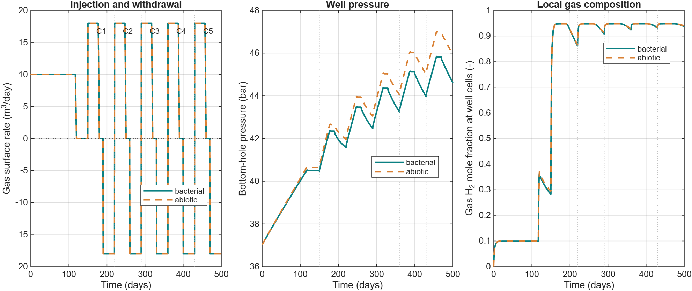

Hydrogen storage in depleted gas reservoirs
===========================================

Compositional flow with bacterial effects · ``h2-biochem``

The biochemistry module extends MRST compositional flow with microbial
populations, reaction pathways, and aqueous tracer transport. This model
family supports studying injected hydrogen mixed with residual reservoir
gases. The selected 2D example uses the existing three-reaction reservoir case
with residual methane and five storage cycles. A one-dimensional notebook
remains available as an introduction.

What the models include
-----------------------

* Soreide–Whitson gas–liquid partitioning.
* Methanogenesis and acetogenesis in the selected introductory notebook.
* Sulfate reduction in the corresponding multi-reaction setups.
* Optional molecular diffusion, dispersion, bacterial diffusion, chemotaxis,
  carbonate feedback, and bioclogging where supported by the setup.

The component mixture depends on the example. The multi-reaction setups
include water, hydrogen, carbon dioxide, methane, hydrogen sulfide, and acetate.

Five-cycle 2D example
---------------------

.. code-block:: matlab

   startupH2sim
   results = exampleCompositionalBacterial2DThreeReactions( ...
       'numCycles', 5, 'scenarios', {'bacterial','abiotic'}, ...
       'molecularDiffusion', false, 'molecularDispersion', false);

This uses the original geometry, layered rock, 0.5 m grid spacing, residual
methane, and default MET/ACE/SRB kinetic parameters. The selected comparison
disables additional transport and clogging effects. It uses MRST-owned
kinetics and requires neither PHREEQC nor Parallel Computing Toolbox.
Accepted states, wells, reports, and full setups are saved for replotting.
For this larger case, the optional AMGCL solver retains the compositional,
bacterial, and aqueous-tracer cell unknowns together. Its native thread count
is configurable through ``setupOptimizedLinearSolver``. See :doc:`installation`.

.. button-ref:: notebooks/bacterial_storage_2d
   :color: primary

   Open the 2D bacterial storage notebook →

   Cycling well response. The well-cell gas fraction is a local sample,
   not a flow-weighted production purity.

Introductory notebook
----------------------

``simple1DBacterialExampleMetacet`` provides a smaller introduction to grid
construction, wells, microbial populations, and compositional transport.

.. button-ref:: nblinks/simple1DBacterialExampleMetacet
   :color: secondary

   Open the introductory notebook →

Equation ownership
------------------

With ``phreeqcTimestepCoupling=false``, microbial source terms are owned by
MRST. The optional PHREEQC workflows change how chemistry is closed and,
for the compositional backend, which solver owns microbial kinetics.
See :doc:`phreeqc` before switching backends.

Inspect ``state.nbact`` for modeled microbial populations and the appropriate
component/tracer fields for transport. Consumption means hydrogen removed by
microbial reactions; it is distinct from unrecovered gas during withdrawal.
