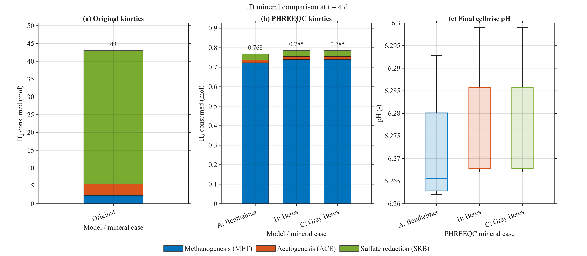
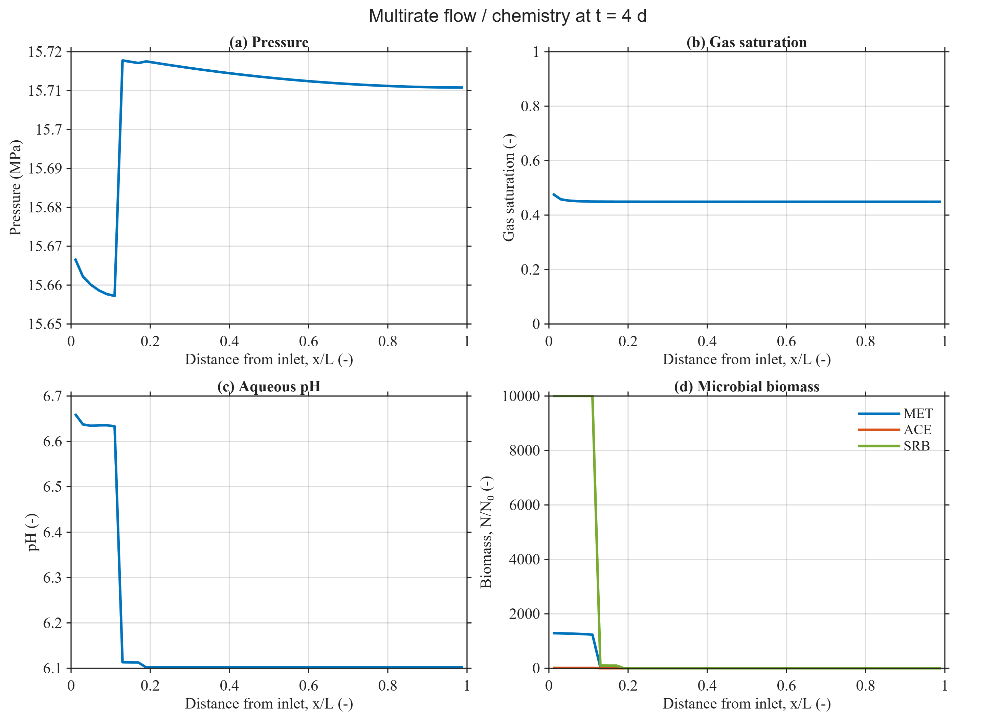

Selected examples and notebooks
===============================

Read the notebooks in your browser and run their MATLAB commands locally.
Start with the compact setups below. None is a field-scale cycle study.

Storage in saline aquifers
--------------------------

.. grid:: 1

   .. grid-item-card:: Hydrogen–brine displacement
      :link: notebooks/blackoil_storage
      :link-type: doc

      A 40-cell horizontal column, 12 injection steps, and explicit tutorial
      fluid assumptions. Serial, offline, and without PHREEQC.

Storage in depleted gas reservoirs
----------------------------------

.. grid:: 1

   .. grid-item-card:: Microbial growth and compositional transport
      :link: nblinks/simple1DBacterialExampleMetacet
      :link-type: doc

      The existing MRST notebook introduces wells, component transport,
      methanogenesis, and acetogenesis.

PHREEQC workflows
-----------------

.. grid:: 1 1 2 2
   :gutter: 3

   .. grid-item-card:: Mineral-chemistry comparison
      :link: notebooks/mineral_comparison
      :link-type: doc

      Four cells and two injection timesteps. Inspect three mineral
      configurations, pH, and saved chemistry inventories.

   .. grid-item-card:: Multirate local reactions
      :link: notebooks/multirate_reactions
      :link-type: doc

      Two flow timesteps with local reaction substeps. MRST owns kinetics;
      PHREEQC supplies aqueous equilibrium feedback.

Download the notebooks
----------------------

* :download:`Black-oil tutorial <notebooks/blackoil_storage.ipynb>`
* :download:`Bacterial-flow notebook <../h2-biochem/examples/1D_validation/notebooks/simple1DBacterialExampleMetacet.ipynb>`
* :download:`Mineral comparison <notebooks/mineral_comparison.ipynb>`
* :download:`Multirate reactions <notebooks/multirate_reactions.ipynb>`

Saved plots are embedded in the new notebooks. Run their commands locally in
MATLAB; the website build does not require a MATLAB notebook kernel.

Example figures
---------------

The figures below come from the runnable short PHREEQC examples. Backend
kinetic ownership differs; their comparison is not a pure mineral sensitivity.

   Short mineral comparison. The original MRST case has no PHREEQC pH.

   Multirate example profiles after two flow timesteps.

.. toctree::
   :hidden:

   notebooks/blackoil_storage
   nblinks/simple1DBacterialExampleMetacet
   notebooks/mineral_comparison
   notebooks/multirate_reactions
