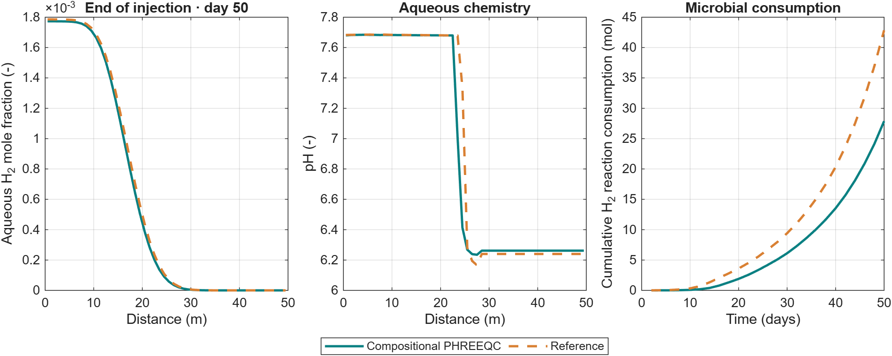

Selected examples and notebooks
===============================

Run the MATLAB commands locally and inspect their saved results in the
notebooks. Start with a representative storage or validation case, then use
the smaller workflow checks to explore chemistry settings.

Storage in saline aquifers
--------------------------

.. grid:: 1

   .. grid-item-card:: 2D aquifer storage cycle
      :link: notebooks/blackoil_storage
      :link-type: doc

      Hydrogen build-up, structural trapping, injection, and withdrawal in
      the existing aquifer model. Gravity, capillarity, and dissolved hydrogen.

Storage in depleted gas reservoirs
----------------------------------

.. grid:: 1

   .. grid-item-card:: Five-cycle 2D storage with three reactions
      :link: notebooks/bacterial_storage_2d
      :link-type: doc

      The existing 2D case with residual methane, MET, ACE, and SRB.
      Compare bacterial and abiotic injection and withdrawal on the original grid.

Thermodynamics
--------------

.. grid:: 1

   .. grid-item-card:: Phase partitioning and salting-out
      :link: notebooks/thermodynamics
      :link-type: doc

      Compare RK, SW, PR, and Henry–Setschenow calculations with supplied
      ePC-SAFT reference tables. Inspect the route to black-oil PVT tabulation.

PHREEQC validation
------------------

.. grid:: 1

   .. grid-item-card:: Compositional PHREEQC injection validation
      :link: notebooks/phreeqc_validation
      :link-type: doc

      A 50-cell injection benchmark with a separate reference implementation.
      Compare dissolved hydrogen, pH, and cumulative reaction consumption.

   PHREEQC injection validation. The source of the reference and the differences
   in chemistry splitting are described in the notebook.

Short chemistry walkthroughs
----------------------------

.. grid:: 1 1 2 2
   :gutter: 3

   .. grid-item-card:: Mineral chemistry setup check
      :link: notebooks/mineral_comparison
      :link-type: doc

      Four cells and two timesteps to check database loading, mineral
      inventories, pH, and saved output. A workflow check, not a spatial validation.

   .. grid-item-card:: Multirate workflow walkthrough
      :link: notebooks/multirate_reactions
      :link-type: doc

      Two flow steps followed by local microbial reaction substeps.
      MRST owns kinetics; PHREEQC supplies aqueous equilibrium feedback.

Download the notebooks
----------------------

* :download:`2D aquifer <notebooks/blackoil_storage.ipynb>`
* :download:`2D bacterial storage <notebooks/bacterial_storage_2d.ipynb>`
* :download:`Introductory microbial transport <../h2-biochem/examples/1D_validation/notebooks/simple1DBacterialExampleMetacet.ipynb>`
* :download:`Thermodynamics <notebooks/thermodynamics.ipynb>`
* :download:`PHREEQC validation <notebooks/phreeqc_validation.ipynb>`
* :download:`Mineral setup check <notebooks/mineral_comparison.ipynb>`
* :download:`Multirate walkthrough <notebooks/multirate_reactions.ipynb>`

Saved plots are embedded in the notebooks. The documentation build does not
execute MATLAB or require a MATLAB notebook kernel.

.. toctree::
   :hidden:

   notebooks/blackoil_storage
   notebooks/bacterial_storage_2d
   nblinks/simple1DBacterialExampleMetacet
   notebooks/phreeqc_validation
   notebooks/mineral_comparison
   notebooks/multirate_reactions
