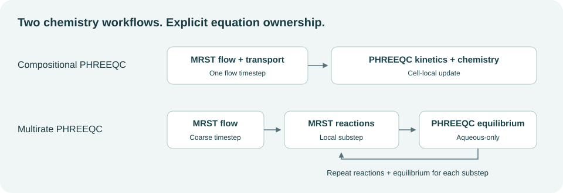

PHREEQC coupling
================

Two supported chemistry workflows share MRST flow and EOS gas–liquid
partitioning, but assign microbial kinetics differently.

.. list-table:: Workflow ownership
   :header-rows: 1
   :widths: 25 25 25 25

   * - Workflow
     - Flow / transport
     - Microbial kinetics
     - Equilibrium chemistry
   * - Compositional PHREEQC
     - MRST
     - Cell-local PHREEQC kinetics
     - PHREEQC after a flow timestep
   * - Multirate PHREEQC
     - Coarse MRST flow step
     - MRST local reaction substeps
     - Aqueous-only PHREEQC after each reaction substep

Injection validation
--------------------

.. code-block:: matlab

   result = runPhreeqcValidation('ugfactRoot', referenceRoot);
   plotCompositionalPhreeqcValidation(result);

The selected validation uses 50 cells over 50 m and the 50-day injection
phase of a separate reference implementation. It compares dissolved hydrogen,
pH, and cumulative hydrogen consumption using a common Soreide–Whitson EOS at 2.865 mol/kg salt molality and
moderate kinetic rates. H2sim applies chemistry once per 2-day flow step;
the reference uses five chemistry substeps within each flow step.

The saved comparison reproduces the dissolved-H2 plateau closely, while the
pH front differs by about one cell. The reported consumption diagnostics
differ substantially: about 27.9 mol for H2sim and 42.8 mol for the reference
over 50 days. The reference curve integrates its reported end-of-step rates;
H2sim accumulates accepted PHREEQC reaction amounts. This comparison does
not establish matching kinetic histories or timestep convergence. H2sim
tracks acetate as an EOS component; the reference includes nitrogen and
carries aqueous organic carbon separately. These component-bookkeeping
differences are retained in this cross-implementation benchmark. The run
also reports small sulfur-balance residuals above the configured audit
tolerance, with a maximum absolute residual of about 2.9e-7 mol.

.. button-ref:: notebooks/phreeqc_validation
   :color: primary

   Open PHREEQC validation →

The reference implementation is
`UGFACT <https://github.com/ahmadrezashojaee/UGFACT>`_ by Ahmadreza Shojaee.
It remains a separate dependency for this comparison. Its sources are staged
locally for Windows COM execution. The adapter uses the configured SW EOS
for its post-chemistry reflash and the matching methane component alias;
the reference kinetic equations are retained.

Compositional kinetic coupling
------------------------------

Set ``phreeqcBackend='sequential-compositional-phreeqc'`` and enable timestep
coupling. PHREEQC integrates MET, ACE, and SRB kinetic amounts locally. MRST's
implicit microbial source terms are disabled to prevent double counting.
Aqueous tracers remain transported in MRST.

.. code-block:: matlab

   comparison = exampleCompositionalBacterial1DPhreeqcMinerals( ...
       'gridCells', 4, 'maximumFlowSteps', 2);

Batches reduce COM overhead. The default batch size is 50; use
``sequentialCompositionalPhreeqcBatchSize=1`` for individual cell calls.
Inactive-cell skipping records an explicit execution mask; a skipped identity
update is not an independently evaluated chemistry audit.

.. button-ref:: notebooks/mineral_comparison
   :color: primary

   Open the mineral chemistry setup check →

Multirate aqueous equilibrium
-----------------------------

The multirate model follows each coarse flow step with bounded local MRST
microbial reaction substeps. PHREEQC equilibrates aqueous/mineral chemistry
after each substep and refreshes the kinetic feedback. Its input contains
no PHREEQC ``RATES`` or ``KINETICS`` blocks.

.. code-block:: matlab

   summary = exampleSequentialBiochemistryPhreeqc1D( ...
       'maximumFlowSteps', 2, 'plotResults', true, ...
       'phreeqcReflashParallel', false);

``reactionSubstepMaxDt`` controls the local reaction cadence. Pressure
flashes run serially by default; Parallel Computing Toolbox is optional.
The separate ``simulateSequentialH2BiochemPhreeqc`` runner is an outer Picard
scheme, distinct from this coarse-flow multirate example.

.. button-ref:: notebooks/multirate_reactions
   :color: primary

   Open the multirate notebook →

Conservation diagnostics
------------------------

The compositional backend records per-cell elemental inventories and warns
when configured tolerances are exceeded. Inspect ``phreeqcElementBalancePass``
and ``phreeqcElementBalanceEvaluatedCells``.

The current equilibrium-only implementation has its elemental audit disabled;
its post-equilibrium EOS component-inventory audit remains active. A passing
EOS audit alone does not establish elemental conservation across the chemistry
handoff. Backend comparisons may also change kinetic parameters and ownership;
a difference is not automatically a mineral or pH effect.

Profiling tools
---------------

.. code-block:: matlab

   results = profilePhreeqcWorkflows('backends', {'compositional'}, ...
       'collectProfiles', false, 'trials', 3);

Paired states and timings are saved under ``build/phreeqc-performance``.
Compare states and diagnostics before interpreting runtime improvements.
