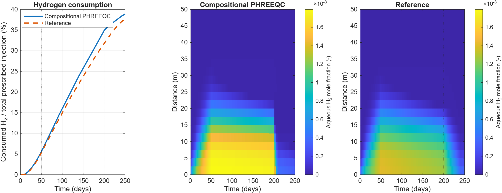
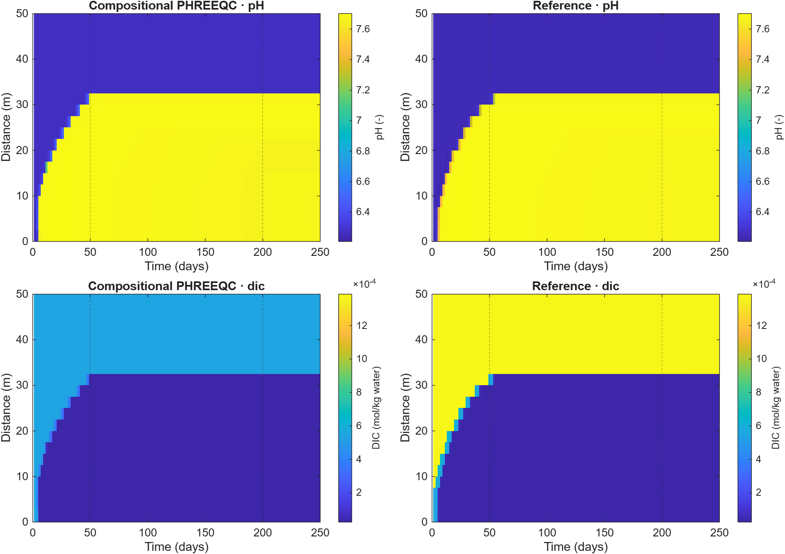
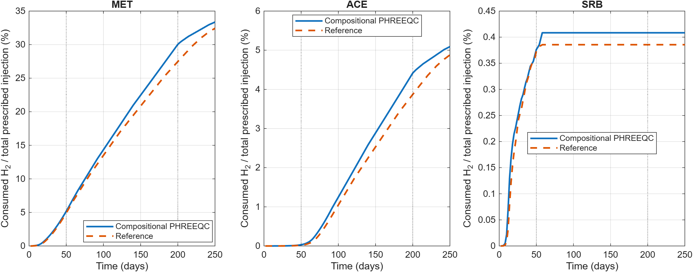

PHREEQC coupling
================

Two supported chemistry workflows share MRST flow and EOS gas–liquid
partitioning, but assign microbial kinetics differently.

.. image:: _static/workflows.svg
   :alt: Compositional PHREEQC assigns local kinetics to PHREEQC; multirate PHREEQC retains MRST kinetics and calls aqueous equilibrium after reaction substeps.
   :width: 100%

.. list-table:: Workflow ownership
   :header-rows: 1
   :widths: 25 25 25 25

   * - Workflow
     - Flow / transport
     - Microbial kinetics
     - Equilibrium chemistry
   * - Compositional PHREEQC
     - MRST
     - Cell-local PHREEQC kinetics
     - PHREEQC after a flow timestep
   * - Multirate PHREEQC
     - Coarse MRST flow step
     - MRST local reaction substeps
     - Aqueous-only PHREEQC after each reaction substep

Complete-cycle validation
-------------------------

.. code-block:: matlab

   result = runPhreeqcValidation('ugfactRoot', referenceRoot, ...
       'gridCells', 20, 'totalDays', 250, 'rate', 'highrate');
   plotCompositionalPhreeqcValidation(result);

The selected comparison uses a 20-cell, 50 m column and a complete 250-day
cycle: 50 days of injection, 150 days of storage, and 50 days of production.
Both implementations use Soreide–Whitson thermodynamics at 2.865 mol/kg NaCl
and the high-rate MET/ACE/SRB parameter set. H2sim applies one chemistry split
per 2-day flow step; the reference uses five chemistry substeps. Diffusion,
dispersion, bacterial diffusion, chemotaxis, and bioclogging are disabled.
Use a smaller even ``totalDays`` value for a prefix of this same schedule,
for example ``totalDays=2`` to check the first flow/chemistry step.
The saved full-cycle results replace the earlier 50-day, moderate-rate example.

All consumption percentages use the **total prescribed hydrogen injection**
as a fixed denominator, including at earlier times. The prescribed gas
volume is converted to a nominal ideal-gas amount at the facility reference
conditions (101325 Pa and 288.15 K). This differs from normalization by
cumulative injection at each plotted time. Consumption is a reaction-source
quadrature diagnostic, not an independent well-inventory deficit; dissolution
and unrecovered gas are excluded.

   Hydrogen consumption and dissolved-H₂ evolution over the complete cycle.
   Vertical lines mark the day-50 and day-200 control changes.

.. list-table:: Consumed hydrogen (% of total prescribed injection)
   :header-rows: 1

   * - Implementation
     - Day 50
     - Day 200
     - Day 250
   * - Compositional PHREEQC
     - 5.577
     - 34.862
     - 38.857
   * - Reference
     - 5.303
     - 31.728
     - 37.704

Conversion continues during storage without fresh injection. The final
compositional result exceeds the reference by 1.153 percentage points.
These results retain the measured discrepancy; they do not demonstrate
splitting or spatial convergence. H2sim tracks acetate as an EOS component,
whereas the reference uses nitrogen and separate aqueous organic-carbon
bookkeeping.

Geochemical evolution
~~~~~~~~~~~~~~~~~~~~~

   pH and total dissolved inorganic carbon (DIC) over 250 days. Color limits
   are shared between implementations for each observable. DIC is total
   inorganic-carbon molality, not only dissolved CO₂; the reference records
   it directly from PHREEQC selected output.

The pH and DIC fronts show how reactive aqueous chemistry evolves throughout
injection, storage, and production. Similar bulk consumption does not imply
identical spatial chemistry. The compositional run records 87 cell-step
element-audit failures, with a maximum absolute residual of 3.61 × 10⁻⁵ mol.
The reference does not expose the same elemental audit. These limitations
remain part of the comparison.

Consumption by reaction
~~~~~~~~~~~~~~~~~~~~~~~

   Separate MET, ACE, and SRB contributions, each normalized by total
   prescribed hydrogen injection. Their sum equals the total-consumption
   curve for the corresponding implementation.

At day 250, the compositional contributions are 33.357% (MET), 5.092% (ACE),
and 0.408% (SRB), compared with 32.439%, 4.879%, and 0.386% in the reference.
All plots use the full 0–250-day interval. Setups and accepted outputs remain
saved as packed simulations; the plotting function also exports the loss
history as CSV and every figure as PNG and vector PDF.

.. button-ref:: notebooks/phreeqc_validation
   :color: primary

   Open PHREEQC validation →

The reference implementation is
`UGFACT <https://github.com/ahmadrezashojaee/UGFACT>`_ by Ahmadreza Shojaee.
It remains a separate dependency for this comparison. Its sources are staged
locally for Windows COM execution. The adapter uses the configured SW EOS
for its post-chemistry reflash and the matching methane component alias;
the reference kinetic equations are retained.

Compositional kinetic coupling
------------------------------

Set ``phreeqcBackend='sequential-compositional-phreeqc'`` and enable timestep
coupling. PHREEQC integrates MET, ACE, and SRB kinetic amounts locally. MRST's
implicit microbial source terms are disabled to prevent double counting.
Aqueous tracers remain transported in MRST.

.. code-block:: matlab

   comparison = exampleCompositionalBacterial1DPhreeqcMinerals( ...
       'gridCells', 4, 'maximumFlowSteps', 2);

Batches reduce COM overhead. The default batch size is 50; use
``sequentialCompositionalPhreeqcBatchSize=1`` for individual cell calls.
Inactive-cell skipping records an explicit execution mask; a skipped identity
update is not an independently evaluated chemistry audit.

.. button-ref:: notebooks/mineral_comparison
   :color: primary

   Open the mineral chemistry setup check →

Multirate aqueous equilibrium
-----------------------------

The multirate model follows each coarse flow step with bounded local MRST
microbial reaction substeps. PHREEQC equilibrates aqueous/mineral chemistry
after each substep and refreshes the kinetic feedback. Its input contains
no PHREEQC ``RATES`` or ``KINETICS`` blocks.

.. code-block:: matlab

   summary = exampleSequentialBiochemistryPhreeqc1D( ...
       'maximumFlowSteps', 2, 'plotResults', true, ...
       'phreeqcReflashParallel', false);

``reactionSubstepMaxDt`` controls the local reaction cadence. Pressure
flashes run serially by default; Parallel Computing Toolbox is optional.
The separate ``simulateSequentialH2BiochemPhreeqc`` runner is an outer Picard
scheme, distinct from this coarse-flow multirate example.

.. button-ref:: notebooks/multirate_reactions
   :color: primary

   Open the multirate notebook →

Conservation diagnostics
------------------------

The compositional backend records per-cell elemental inventories and warns
when configured tolerances are exceeded. Inspect ``phreeqcElementBalancePass``
and ``phreeqcElementBalanceEvaluatedCells``.

The current equilibrium-only implementation has its elemental audit disabled;
its post-equilibrium EOS component-inventory audit remains active. A passing
EOS audit alone does not establish elemental conservation across the chemistry
handoff. Backend comparisons may also change kinetic parameters and ownership;
a difference is not automatically a mineral or pH effect.

Profiling tools
---------------

.. code-block:: matlab

   results = profilePhreeqcWorkflows('backends', {'compositional'}, ...
       'collectProfiles', false, 'trials', 3);

Paired states and timings are saved under ``build/phreeqc-performance``.
Compare states and diagnostics before interpreting runtime improvements.
