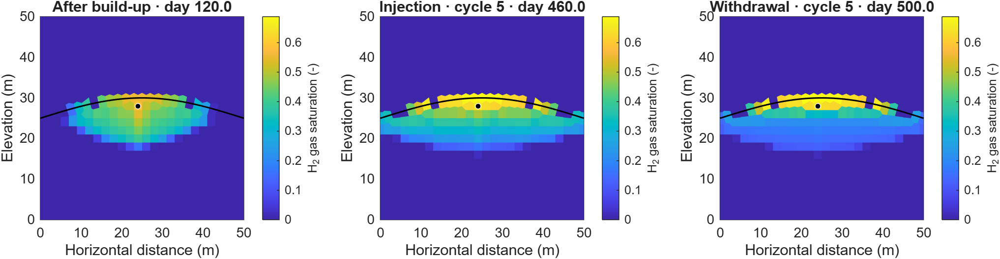
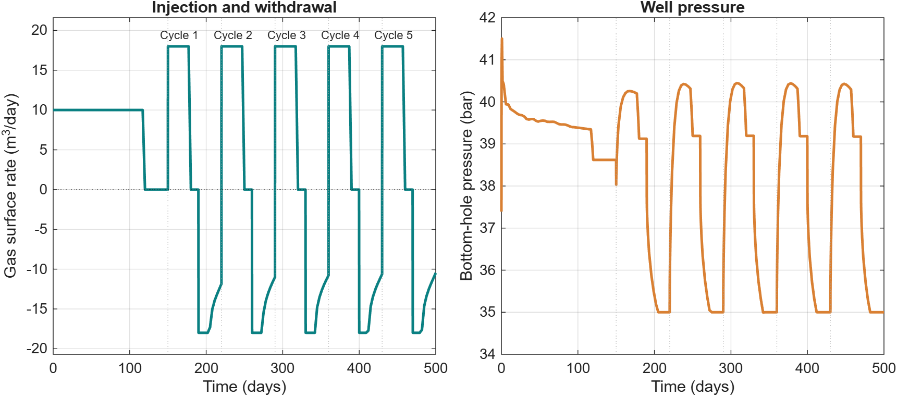

Hydrogen storage in saline aquifers
===================================

Black-oil models · ``h2-store``

The storage module connects hydrogen–brine fluid properties to MRST black-oil
models. It provides PVT tabulation, relative-permeability tools, and aquifer
setups for injection, storage, and withdrawal.

A 2D structural-trap example
----------------------------

.. code-block:: matlab

   result = exampleBlackOilAquifer2D('numCycles', 5);

This example uses the existing 50 m × 50 m illustrative aquifer setup.
A curved low-permeability caprock overlies the reservoir, with bedrock below.
A single well sits beneath the crest. Gravity, capillary pressure, and
hydrogen dissolution are included; lateral boundaries use hydrostatic
pressure. The bundled input uses zero added salt and disables diffusion.

The default teaching grid has a 2 m target spacing. The original setup's
0.5 m target spacing remains available. The schedule includes a 120-day
hydrogen build-up, a 30-day shut-in, then five 70-day storage cycles
(30 days of injection, 10 days idle, and 30 days withdrawal). Results are
saved through MRST packed simulation output and can be replotted locally.
Withdrawal has a 35 bar minimum bottom-hole pressure limit, so the well can
reduce its rate as available hydrogen decreases.

   Hydrogen plume snapshots after build-up and in the fifth cycle. The same saturation
   color scale is used in every panel.

   Well response through the prescribed storage schedule. Positive gas rate
   denotes injection and negative gas rate denotes withdrawal.

.. button-ref:: notebooks/blackoil_storage
   :color: primary

   Open the 2D aquifer notebook →

Black-oil interpretation
------------------------

The MRST oil phase represents liquid water/brine and the gas phase represents
hydrogen. ``DISGAS`` enables hydrogen dissolved in the liquid; ``VAPOIL``
enables vaporized water when supported by the supplied PVT tables. The
selected aquifer deck enables dissolution and does not enable vaporization.

The example uses the public illustrative-case input tables accompanying
Ahmed et al., *Phase behavior and black-oil simulations of hydrogen storage
in saline aquifers* (2024). Input provenance is recorded in
``h2-store/examples/data/Aquifer2D/README.md``.

Build fluid tables
------------------

``examplePVTGenerationH2Brine`` demonstrates pure-component properties,
solubility, and PVT generation. New NIST data tables require network access.
See :doc:`thermodynamics` for RK, SW, Henry–Setschenow, ePC-SAFT reference
comparisons, and the route from phase behavior to black-oil tables.
