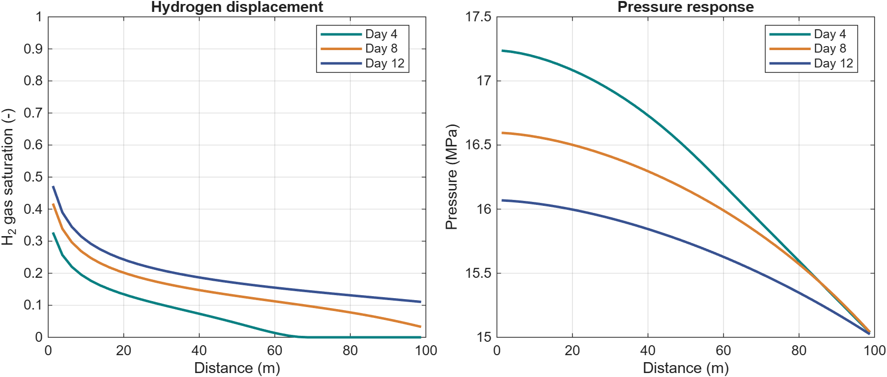

Hydrogen storage in saline aquifers
===================================

Black-oil models · ``h2-store``

The storage module connects hydrogen–brine fluid properties to MRST's
black-oil models. It provides solubility and PVT table-generation tools,
relative-permeability utilities, and aquifer setup functions.

Black-oil interpretation
------------------------

In the two-phase examples, the MRST oil phase represents liquid brine and
the gas phase represents hydrogen. ``DISGAS`` enables dissolved hydrogen;
``VAPOIL`` enables vaporized liquid where supported by the supplied tables.
The compact tutorial disables both to isolate immiscible displacement.

A small runnable example
------------------------

.. code-block:: matlab

   result = exampleBlackOilH2Storage1D('gridCells', 40, 'numSteps', 12);

The model uses a 100 m horizontal column with an H₂ injector and a
fixed-pressure outlet. Hydrogen gas density uses the module's Brill–Beggs
correlation. Brine density and phase viscosities are fixed tutorial values;
gravity is disabled. This is a code tutorial, not a field-scale prediction.

   Serial black-oil injection tutorial. The full setup and state history
   are returned in ``result``.

.. button-ref:: notebooks/blackoil_storage
   :color: primary

   Open the black-oil notebook →

Build fluid tables
------------------

``examplePVTGenerationH2Brine`` demonstrates component properties,
solubility, and black-oil PVT table generation. Its NIST data-generation
steps need network access. ``HenrySetschenowH2BrineEos`` evaluates the local
hydrogen solubility correlation without downloading data.

Use :doc:`thermodynamics` to understand units, inputs, and the difference
between a property table and a compositional flash.
