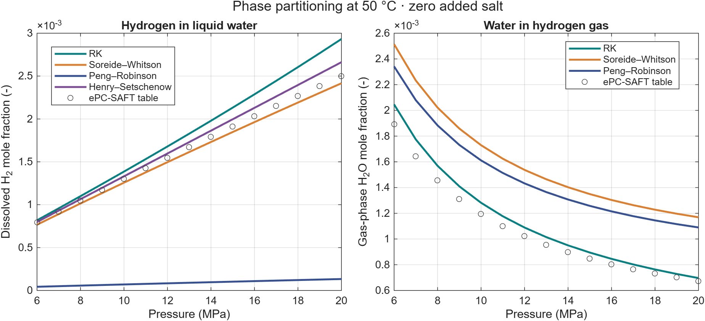
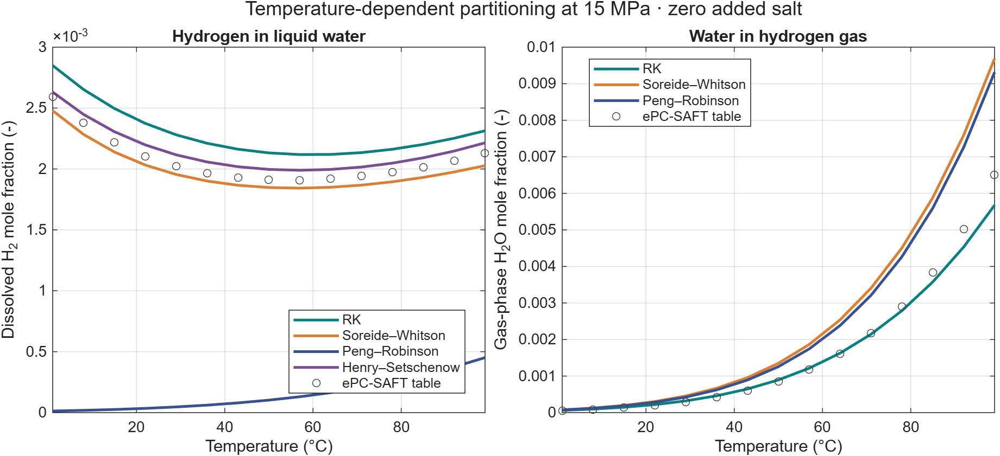
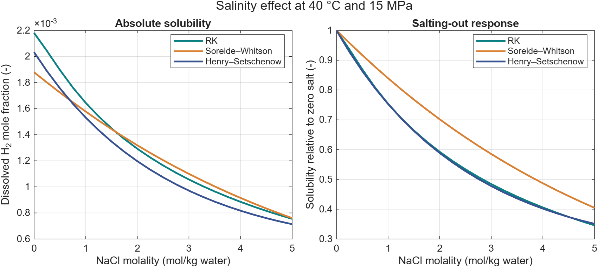

Thermodynamics and PVT tabulation
=================================

H2sim connects hydrogen–brine phase behavior to compositional flow and
black-oil storage simulations. Choose a property model, examine its
partitioning and salinity response, then generate the tables your flow model
requires.

Phase-behavior capabilities
---------------------------

.. list-table:: Available calculations
   :header-rows: 1
   :widths: 22 40 38

   * - Approach
     - Capability
     - Implementation
   * - Redlich–Kwong (RK)
     - Hydrogen dissolution and water partitioning, including salt corrections
     - ``generateH2BrineSolubilityTable``
   * - Søreide–Whitson (SW)
     - Compositional gas–liquid flash with salinity-dependent interactions
     - ``SoreideWhitsonEos``
   * - Peng–Robinson (PR)
     - General compositional flash; binary interactions can be specified
     - MRST ``EquationOfStateModel``
   * - Henry–Setschenow
     - Dissolved hydrogen from H₂ partial pressure, temperature, and salt molality
     - ``HenrySetschenowH2BrineEos``
   * - ePC-SAFT reference tables
     - Compare gas and liquid partitioning with supplied tabulated reference values
     - Bundled ``ePcSaftH2BrineData.mat``; no live PC-SAFT solver is included
   * - Black-oil PVT tables
     - Formation-volume factors, solution ratio, vaporized-water ratio, and viscosities
     - ``getFluidH2BrineProps`` with component and solubility tables

Two selected studies
--------------------

Run the existing hydrogen–brine study:

.. code-block:: matlab

   study = exampleH2BrineSolubilityStudy;
   plotH2BrineSolubilityStudy(study);

The first study evaluates partitioning over the reference temperature and
pressure grid. The figure shows the 50 °C slice from 6 to 20 MPa. It compares
hydrogen in liquid water and water in the hydrogen gas phase. The supplied
ePC-SAFT values are a near-pure-water reference. The generic PR curve uses
its default binary interactions; it is not a calibrated hydrogen–water model.
Henry–Setschenow supplies liquid hydrogen solubility, not gas-phase water.

   Phase partitioning at zero added salt. Curves represent distinct property
   models; agreement with a reference curve does not validate every model
   over other temperatures, pressures, or salt concentrations.

The same saved grid also shows the temperature response from 1 to 99 °C
at 15 MPa, with zero added salt. Both panels use the same model definitions
as the pressure comparison; the ePC-SAFT markers are tabulated reference
values.

   Temperature-dependent hydrogen–water partitioning. Henry–Setschenow
   provides only the dissolved-hydrogen curve.

The second study holds temperature at 40 °C and pressure at 15 MPa while
varying NaCl molality from zero to 5 mol/kg water. Absolute solubility and
solubility normalized by the zero-salt value show the salting-out response
without mixing it with a pressure or temperature change.

   Salting-out comparison. These are implemented model calculations,
   not newly measured experimental data.

.. button-ref:: notebooks/thermodynamics
   :color: primary

   Open the thermodynamics notebook →

From phase behavior to black-oil PVT
------------------------------------

``examplePVTGenerationH2Brine`` demonstrates the complete tabulation route:

1. Generate pure hydrogen and water density/viscosity tables with
   ``generateComponentProperties``.
2. Compute dissolved hydrogen and water partitioning with
   ``generateH2BrineSolubilityTable`` or supply compatible reference tables.
3. Pass matching temperature/pressure samples to ``getFluidH2BrineProps``.
4. Export ``PVTO``, ``PVDO``, and ``PVTG`` tables as selected by the
   dissolution and vaporization options, then use them in an Eclipse deck.

.. code-block:: matlab

   getFluidH2BrineProps(waterTable, hydrogenTable, solubilityTable, ...
       'rs', true, 'rv', false, 'plot', true, ...
       'outputPath', fullfile(pwd, 'build', 'pvt-tables'));

The pure-component generation scripts fetch NIST data when creating new
tables. The two selected studies run locally from correlations and bundled
reference data, and require no Parallel Computing Toolbox. The 2D aquifer
example reads existing PVT tables rather than regenerating them.

Units and interpretation
------------------------

Compositional flashes use temperature in kelvin and pressure in pascals.
The solubility-table generator's temperature bounds are in degrees Celsius;
its pressure bounds are in pascals. NaCl molality is mol/kg water. Brill–Beggs
returns a dimensionless hydrogen compressibility factor from kelvin and
pascals. PVT exports use the selected deck unit system.

For Henry–Setschenow, the pressure input is the hydrogen partial pressure.
The selected hydrogen-dominated comparison approximates it by total pressure.
PHREEQC handles aqueous speciation and mineral chemistry; the EOS retains
ownership of the gas–liquid split in the coupled workflows.

.. toctree::
   :hidden:

   notebooks/thermodynamics
