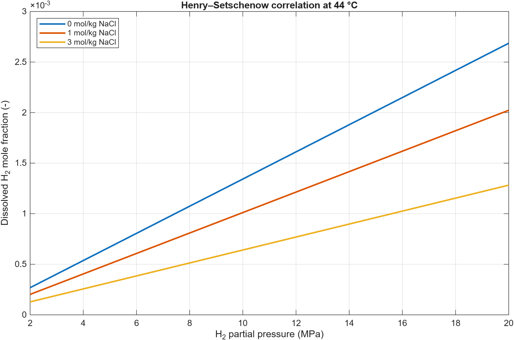

Thermodynamics and fluid properties
===================================

Understand the property model before selecting a flow solver. Black-oil
PVT tables and a compositional EOS provide different representations of
hydrogen–brine phase behavior.

Property tools
--------------

.. list-table:: Functions supplied by H2sim
   :header-rows: 1
   :widths: 55 45

   * - Function
     - Use
   * - ``HenrySetschenowH2BrineEos``
     - Dissolved H₂ mole fraction from temperature, salt molality, and H₂ partial pressure
   * - ``calculateBrillBreggsZfactorHydrogen``
     - Dimensionless H₂ compressibility factor from temperature and pressure
   * - ``generateH2WaterSolubilityTable``
     - H₂–water solubility table generation
   * - ``generateComponentProperties``
     - Pure-component properties; NIST access when generating new data
   * - ``getFluidH2BrineProps``
     - Write black-oil PVT data from component and solubility tables
   * - ``SoreideWhitsonEos``
     - Compositional gas–liquid equilibrium in biochemical models

A local solubility calculation
------------------------------

.. code-block:: matlab

   pressure = linspace(2e6, 20e6, 60).'; % H2 partial pressure, Pa
   temperature = repmat(317.15, size(pressure)); % K
   saltMolality = 3; % mol NaCl / kg water
   tab = HenrySetschenowH2BrineEos(temperature, saltMolality, pressure);
   plot(pressure/1e6, tab.x_H2);
   xlabel('H_2 partial pressure (MPa)');
   ylabel('Dissolved H_2 mole fraction (-)');

Use matching vector lengths for temperature and pressure. This evaluates the
existing correlation locally; no external download or parallel toolbox is needed.

   The local correlation at 44 °C. These curves illustrate the implemented
   function; they are not a new experimental validation.

Keep units explicit
-------------------

The solubility function takes temperature in kelvin, pressure in pascals,
and NaCl molality in mol/kg water. The Brill–Beggs implementation also takes
pressure in pascals and returns a dimensionless ``Z`` factor. Check each
function's interface before mixing molality, mass concentration, and mole fractions.

Black-oil versus compositional
------------------------------

Black-oil models use tabulated formation-volume and solution-ratio functions.
Compositional models solve for phase fractions and component partitioning
with an EOS. PHREEQC aqueous equilibrium adds speciation and mineral chemistry;
it does not replace EOS ownership of the gas–liquid split in the selected workflows.
